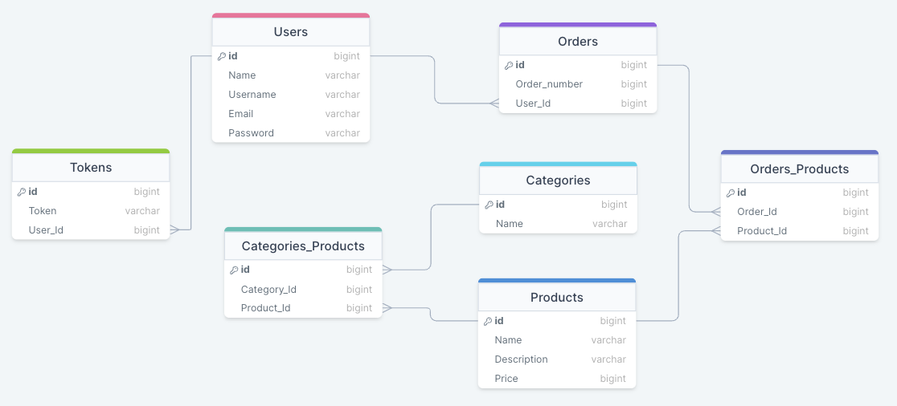

<h1 align="center">Backend project: E-commerce</h1>

## About the project

This project consists in the creation of an E-commerce, using endpoints and a database.

## Technologies used for the project

         

## Summary of the E-commerce

In this project we had to simulate a E-commerce, implementing all the knowledge that we have received in different technologies, for example: Node, express, mysql, sequelize, etc. The database used was MySql, a realtional database so we need to stablish relationships between the entities that we have created.
In my case, I´ve done the E-commerce of a soccer shop in which I can do many things, for example: the creation of users, products, categories. The login and logout of users, etc.

## All the endpoints created

<ul>
    <li>
    Products: The products can be created by using a url, as well as update a product, delete a product and all the endpoints but with their own url. Furthermore, there is an endpoint that can show all the products including the category that it belongs to. 
    Beside of it, there is an endpoint that can show by looking for the product for example, if I put the id 1 the product 1 is showed as well as putting the name and price. Other shows all the products taking into account the price that the product has and it is shown by high to low. 
    I´ve implemented a validation that the product can not be created if some fields aren´t filled and shows a message saying what is missing. The products can only be created/updated and deleted if you are authenticated.
    </li>
    <li>
    Categories: The categories can be created as well as the products by a url, a category can be updated, besides, can be deleted. Moreover there is an endpoint that allows to show all the categories including their products. Besides of it, other endpoint was created to look for a category and show it and other that do the same but with the name of the category.
    </li>
    <li>
    Orders: The orders have an enpoint that allosw the user to place a order and an endpoint was created to show the orders with their respective products.
    </li>
    <li>
    Users: The users are created and can login, for the login I´ve implemented bcrypt and JWT. Bcrypt can encrypt the password of the user and in the database it appears the encrypted password so it is 100% confidential. 
    The JWT can securely transmit information that the user introduce and it can be signed for preventing the fake creation of one. Moreover an endpoint was created that allows to show the user and the orders and products the user has ordered. 
    A validation was implemented to prevent the user create an user without filling all the fields, if this ocurrs, a message it´s shown and allows the user to recognize what is missing in his/her request.
    </li>
    <li>
    Seeders: Five different products were created using seeders.
    </li>
    <li>
    Admin role: This role was implemented for the creation of products, as well as the elimination and it´s update.
    </li>
</ul>

### Entity Relationship Diagram (ERD)

### Licence

This project is under licence of Nicolás Blanco Zappalá

### Contact

 Nicolás Blanco Zappalá

     

